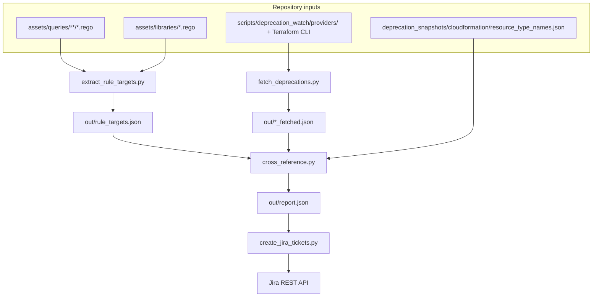
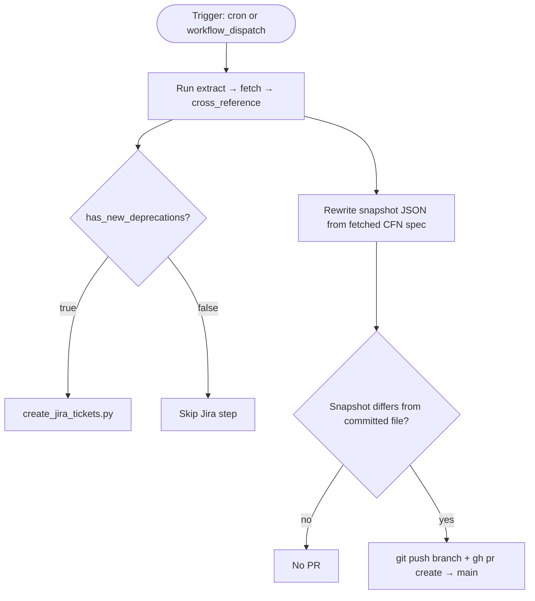
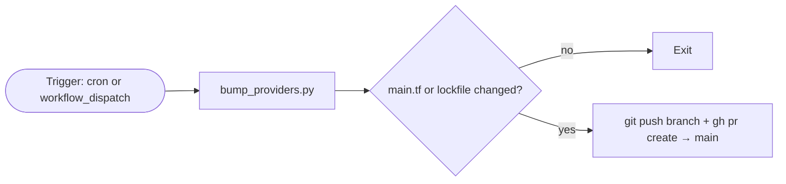

# Deprecation watch — system behavior

This document describes **what the deprecation watch system does** when it runs: data it reads, signals it uses, how it decides what counts as a finding, and how CI reacts. Operational commands and environment variables are in `README.md`.

---

## Purpose

The system compares **upstream deprecation or removal signals** for Terraform, CloudFormation, Kubernetes, Ansible, and CI/CD (GitHub Actions) against **what the scanner’s Rego rules actually target**. When those overlap and the rule is not already treated as covering a replacement, the system records a **finding**. In CI, findings can drive **Jira issue creation** (deduplicated). Separately, CI can open **pull requests** to refresh a CloudFormation type baseline and to bump Terraform provider pins used for schema scraping.

---

## Diagrams

### Core pipeline (scripts and artifacts)

### Weekly workflow (`deprecation-watch`)

### Monthly workflow (`deprecation-watch-bump-providers`)

---

## Data flow (core pipeline)

The same ordered pipeline runs in the weekly workflow and can be run locally:

1. **`extract_rule_targets.py`** — Walks `assets/queries/**/query.rego` (and library helpers where applicable) and writes **`out/rule_targets.json`**: Terraform resource types, CloudFormation types, Kubernetes kinds, Ansible canonical module keys, CI/CD GitHub Action `owner/repo` references, plus the parsed Ansible module map from `assets/libraries/ansible.rego`.

2. **`fetch_deprecations.py`** — Writes JSON under **`out/`** per platform:
   - **Terraform** — Runs `terraform init` (readonly lockfile when present) and `terraform providers schema -json` in `providers/`. Missing CLI or failed init produces an `error` field and empty `providers`.
   - **CloudFormation** — Downloads and validates the AWS resource specification; writes type list and metadata.
   - **Kubernetes** — Fetches latest release tag from GitHub API; builds a deprecation table from Pluto `versions.yaml`. A failed Pluto fetch stores an `error` under `deprecation_table` instead of failing the whole script.
   - **Ansible** — Fetches each configured collection’s `meta/runtime.yml`. Per-collection failures are stored as `error` on that collection; others still populate.
   - **CI/CD** — For every `owner/repo` action reference found in `rule_targets.json`, queries the GitHub API (`GET /repos/{owner}/{repo}`) to check if the repository is active, archived, deleted (404), or moved (301). Uses `GITHUB_TOKEN` when available for higher rate limits.

3. **`cross_reference.py`** — Loads `rule_targets.json`, fetched JSON files, and **`deprecation_snapshots/cloudformation/resource_type_names.json`**. Emits **`out/report.json`** with a `findings` array. Appends **`has_new_deprecations=true|false`** to `GITHUB_OUTPUT` when that file is present (GitHub Actions).

4. **`create_jira_tickets.py`** — Reads `report.json`. With no findings it exits successfully and creates nothing. Otherwise it creates one issue per finding **unless** an **unresolved** Jira issue already exists with the same dedupe label (see below). Dry-run mode prints what would happen without calling Jira.

---

## Finding logic (by platform)

### Terraform

- Deprecated resource types come from each provider schema block’s deprecation markers / descriptions.
- A type is a candidate only if it appears in **`rule_targets.json`** under `terraform` (excluding contexts the cross-reference step intentionally ignores, such as large `check_*` library lists).
- **Suppression:** For a deprecated type, if the **same rule file** already has a **direct** `input.document[…].resource.<TYPE>` reference to another type with the **same provider prefix** (e.g. `aws_`) that is **not** in the deprecated set for that run, the reference is treated as covered and **no finding** is emitted for that rule for that type. References only via module-equivalent helpers or string literals in dynamic-resource paths do **not** count as covering the direct resource path.

### CloudFormation

- **Removal detection:** The live specification’s resource type set is compared to **`deprecation_snapshots/cloudformation/resource_type_names.json`**. Types present in the snapshot but absent from the live spec are treated as **removed**.
- A removed type generates a finding only if rules still reference it under `cloudFormation` in `rule_targets.json`.
- **Suppression:** If the same rule file references another type with the **same `AWS::Service::` prefix** that is **not** among the removed set for this comparison, findings for that file and removed type are suppressed.

### Kubernetes

- **Removed kinds** (Pluto-derived rows with no replacement API) — If a kind appears in rule targets, a **critical** finding is emitted for that kind.
- **Deprecated / removed API versions** (Pluto rows with a replacement API) — Findings are emitted only for rules whose extraction context is **not** one of the “kind-only” patterns (`document.kind`, `resource.kind`, `kinds_set`, `listKinds`). Kind-only rules are assumed to apply regardless of `apiVersion`, so they are **not** flagged for API version churn.

### Ansible

- Runtime rows (deprecation, tombstone, redirect) are resolved to **canonical** module keys using a reverse index of all names in the Ansible library map.
- Severity is **high** for tombstone or deprecation with removal metadata; **medium** for redirect-only rows.
- Rows that do not map to any canonical that has rules are skipped.
- Multiple collections contributing to the same canonical are **merged** into one report row (and one dedupe key).
- **Suppression:** If the canonical’s `variants` in `ansible.rego` already include the **redirect** FQCN (or its short tail), the row is skipped as already supporting the replacement name.

### CI/CD (GitHub Actions)

- Every `owner/repo` action reference hardcoded in CI/CD Rego rules is checked against the GitHub API.
- **Not found (404)** — Repository deleted, made private, or transferred. Severity: **critical**.
- **Archived** — Repository archived by its owner (action abandoned). Severity: **high**.
- **Moved (301)** — Repository renamed or transferred to a different owner. Severity: **high**.
- **Active** repos produce no finding.
- Sub-paths in action references (e.g. `gradle/actions/setup-gradle`) are resolved to the root `owner/repo` (`gradle/actions`) for the API check, since that is the GitHub repository boundary.

---

## Jira behavior

- Each finding is keyed for deduplication by a label **`dw-<12 hex chars>`** derived from `sha256("platform:target")`.
- Before creating an issue, the script runs a Jira search: **same project, same label, resolution empty**. If any issue matches, **no new issue** is created for that finding.
- If the search API fails (non-200), the script **does not create** issues for that run (fail-safe against duplicates).
- Issue bodies include platform, target, severity, source, optional replacement/notes, and a list of affected rule paths and contexts.

---

## GitHub Actions: `deprecation-watch`

**Triggers:** Weekly cron (Monday 09:00 UTC) and `workflow_dispatch`.

**Concurrency:** `deprecation-watch` group; **cancel in progress** so overlapping runs do not stack.

**Job environment:** The job is bound to GitHub Environment **`deprecation-watch`**. Secrets `JIRA_*` for the Jira step are resolved from that environment’s configuration when present.

**Steps (behavioral):**

1. Checkout, Python 3.12, Terraform **1.9.8** (wrapper disabled), optional cache of `providers/.terraform`.
2. Install `requirements.txt`, then run the four-stage pipeline through **cross-reference** (always).
3. **Create Jira tickets** — Runs **only if** `steps.cross-ref.outputs.has_new_deprecations == 'true'` (i.e. `report.json` had at least one finding).
4. **Rotate CFN snapshot and open PR** — Runs if `out/cloudformation_fetched.json` exists after fetch. It overwrites `deprecation_snapshots/cloudformation/resource_type_names.json` from the fetched file. If **git** shows **no diff** under `deprecation_snapshots/`, the step exits successfully and does nothing else. Otherwise it force-pushes branch **`chore/deprecation-watch-cfn-snapshot`**, commits the snapshot file, and runs **`gh pr create`** against **`main`** with label **`maintenance`**, unless an open PR already exists for that head branch.

**Token for `gh` / `git push`:** `GITHUB_TOKEN` with workflow permissions **`contents: write`** and **`pull-requests: write`**.

---

## GitHub Actions: `deprecation-watch-bump-providers`

**Triggers:** Monthly cron (1st of month, 09:00 UTC) and `workflow_dispatch`.

**Concurrency:** `deprecation-watch-bump-providers` group; cancel in progress.

**Single step behavior:**

1. Runs **`bump_providers.py`**, which queries the Terraform Registry for each provider in `providers/main.tf`, bumps version pins when a newer **X.Y.Z** release exists, then runs `terraform init -upgrade` and `terraform providers lock` for **linux_amd64** and **darwin_amd64**.
2. If **`git diff`** on `scripts/deprecation_watch/providers/` is clean, the job exits (no branch, no PR).
3. Otherwise it force-pushes **`chore/deprecation-watch-bump-providers`**, commits **`main.tf`** and **`.terraform.lock.hcl`**, and opens a PR to **`main`** with label **`dependencies`** if none is already open for that branch.

**Token:** Same `GITHUB_TOKEN` permission model as the weekly workflow.

---

## Repository artifacts (what the system reads and writes)

| Artifact | Role |
|----------|------|
| `scripts/deprecation_watch/out/rule_targets.json` | Produced by extract; consumed by cross-reference |
| `scripts/deprecation_watch/out/*_fetched.json` | Produced by fetch; consumed by cross-reference |
| `scripts/deprecation_watch/out/report.json` | Produced by cross-reference; consumed by Jira script |
| `deprecation_snapshots/cloudformation/resource_type_names.json` | **Read** by cross-reference for CFN removals; **overwritten** by the weekly PR step when the live spec differs |
| `scripts/deprecation_watch/providers/main.tf` + `.terraform.lock.hcl` | Define providers for schema fetch; **bumped** by the monthly workflow when registry has newer versions |

---

## Resilience notes (in-script)

- HTTP GETs use retries with backoff for transient failures.
- Terraform init uses **`-lockfile=readonly`** when `.terraform.lock.hcl` exists so CI does not silently rewrite the lockfile during the weekly fetch (lock changes are reserved for the bump workflow or manual bumps).
